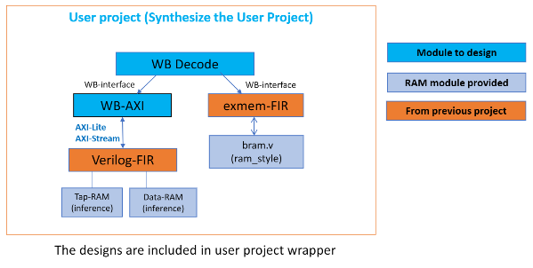
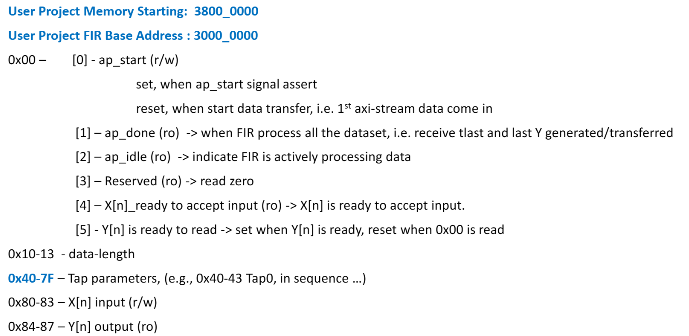

# SoC Lab4-2: Caravel FIR

## Content of work
- Interactions between firmware in user project memory and design in user project
- Integrate **lab-fir** & **lab-exmem-fir** into caravel user project (add **WishBone** interface)
- Execute RISC-V firmware code from user project memroy **(testbench/counter_la_fir/counter_la_fir.c)**
- Firmware code to move data in/out FIR **(rtl/user/design.v)**
- HW/SW co-design
  
## Files
- [synthesis report & area report](synthesis/synthesis.runs/synth_1/user_project_wrapper_utilization_synth.rpt)
- [simulation log](testbench/counter_la_fir/simulation.log)
- [firmware code](testbench/counter_la_fir/counter_la_fir.c)
- [FIR RTL](rtl/user/design.v)
- [testbench](testbench/counter_la_fir/counter_la_fir_tb.v)
- [user project design](rtl/user/user_proj_example.counter.v)

## Toolchain Prerequisites
* [Ubuntu 20.04+](https://releases.ubuntu.com/focal/)
* [Xilinx Vitis 2022.1](https://www.xilinx.com/support/download/index.html/content/xilinx/en/downloadNav/vivado-design-tools/2022-1.html)
* [GTKWave v3.3.103](https://gtkwave.sourceforge.net/)
* [RISC-V GCC Toolchains rv32i-4.0.0](https://github.com/stnolting/riscv-gcc-prebuilt)

## Setup Toolchain
Get presetup Vitis Virtual Machine from course TA or setup following toolchains yourself.
* Ubuntu 20.04+ and Xilinx Vitis [HLS tools installation guide](https://github.com/bol-edu/course-lab_1/blob/2022.1/HLS%20Tools%20Installation%20Guide%202022.1_ubuntu.md)
* GTKWave and RISC-V GCC Toolchains
```console
$ sudo apt update
$ sudo apt install gtkwave git -y
$ sudo wget -O /tmp/riscv32-unknown-elf.gcc-12.1.0.tar.gz https://github.com/stnolting/riscv-gcc-prebuilt/releases/download/rv32i-4.0.0/riscv32-unknown-elf.gcc-12.1.0.tar.gz
$ sudo mkdir /opt/riscv
$ sudo tar -xzf /tmp/riscv32-unknown-elf.gcc-12.1.0.tar.gz -C /opt/riscv
$ echo 'export PATH=$PATH:/opt/riscv/bin' >> ~/.bashrc
$ source ~/.bashrc
```

## Simulation for FIR
```sh
$ cd ./testbench/counter_la_fir
$ source run_clean
$ source run_sim
```


## Details
### ***Design Scope and Hierarchy***

### ***Configuration Register Address map***


### address definition
```c
// @testbench/counter_la_fir/fir.h

// User Project 
#define AP (*(volatile uint32_t*) 0x30000000)
#define data_len (*(volatile uint32_t*) 0x30000010)

// User Project FIR Tap parameters
#define tap0 (*(volatile uint32_t*) 0x30000040)
#define tap1 (*(volatile uint32_t*) 0x30000044)
#define tap2 (*(volatile uint32_t*) 0x30000048)
#define tap3 (*(volatile uint32_t*) 0x3000004c)
#define tap4 (*(volatile uint32_t*) 0x30000050)
#define tap5 (*(volatile uint32_t*) 0x30000054)
#define tap6 (*(volatile uint32_t*) 0x30000058)
#define tap7 (*(volatile uint32_t*) 0x3000005c)
#define tap8 (*(volatile uint32_t*) 0x30000060)
#define tap9 (*(volatile uint32_t*) 0x30000064)
#define tapA (*(volatile uint32_t*) 0x30000068)

#define Xn (*(volatile uint32_t*) 0x30000080)
#define Yn (*(volatile uint32_t*) 0x30000084)
```

### Firmware function Code
```c
// @testbench/counter_la_fir/fir.c

#include "fir.h"

void __attribute__ ( ( section ( ".mprjram" ) ) ) initfir() {
	//initial your fir
	data_len = 64;

	// faster
	tap0 = 0;
	tap1 = -10;
	tap2 = -9;
	tap3 = 23;
	tap4 = 56;
	tap5 = 63;
	tap6 = 56;
	tap7 = 23;
	tap8 = -9;
	tap9 = -10;
	tapA = 0;

	return;
}

int* __attribute__ ( ( section ( ".mprjram" ) ) ) fir(){
	initfir();
	int ans;
	AP = 1;

	// start timer
	reg_mprj_datal = (0xA5 << 16);

	//write down your fir
	for (int i=0; i<64; i++) {
		while ((AP >> 4) & 1 != 1) {} // wait until Xn is ready
		Xn = i;
		while ((AP >> 5) & 1 != 1) {} // wait until Yn is ready
		outputsignal[i] = Yn;
	}

	// output to mprj_io[31:24], and stop timer
	reg_mprj_datal = ((outputsignal[63] & 0xFF) << 24) | (0x5A << 16);
	
	return outputsignal;
}
```

### Top firmware code
```c
// @testbench/counter_la_fir/counter_la_fir.c

int* tmp = fir();

for (int j=0; j<64; j++) {
    reg_mprj_datal = *(tmp + j) << 16;	
}
```

### Simulation testbench
```verilog
// @testbench/counter_la_fir/counter_la_fir_tb.v

assign checkbits  = mprj_io[31:16];

initial begin
	wait(checkbits == 16'hAB40);
	$display("LA Test 1 started");
	
	for (k=0; k<3; k=k+1) begin
		for (l=0; l<64; l=l+1) begin
			wait (checkbits == gold_ans[l][15:0])
				$display("index %d received", l);
		end
		$display("finsih %d iteration", k);
	end		

	wait(checkbits == 16'hAB51);
	$display("overall latency: %d cycles", overall_latency / 25);
	$display("LA Test 2 passed");
	#10;
	$finish;
end
```

## Notes
- We use design.v (module fir) to calculate the actual FIR
- Send data and receive data in **fir()**
- Output calculation result to **reg_mprj_datal**, which would be later shown in **mprj_io** detected by counter_la_fir_tb.v